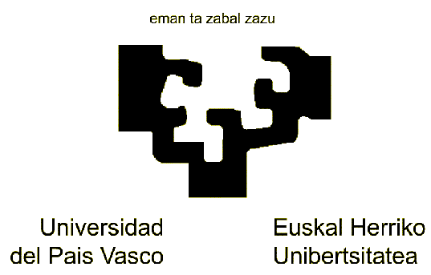
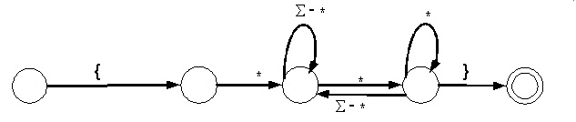

KONPILAZIOA I

Praktikaren dokumentazioa

0. Edukien aurkibidea
*********************

1. Sarrera
**********

Praktikan itzultzaile sinple baten diseinu eta inplementazioa egin ditugu, konpiladore baten front-end bat hain zuzen ere, goitik beherako teknika aurresale errekurtsiboa erabiliz, sintaxiak zuzendutako itzulpen-eskema batetik abiatuz.

Sarrerako lengoaiak, programazio lengoaia ezagunek dituzten eragile (+, -, *, /, <, >, :=, ...) zein kontrol egiturak ditu (if eta while) eta baita egitura horietatik irteteko exit erako agindu baldintzatu eta baldintza gabeak ere.

Sortutako bitarteko kodea 3 helbidetakoa deritzona da x:= a + b; if a >c then goto 014; eta goto 015; erako aginduak onartzen dituena.

Horretaz gain, itzultzaile honek errore sintaktikoen tratamendua egiten du konpilazio garaian.

2. Auto-ebaluazioa
******************

Egindako lanari eta praktikaren enuntziatuan dioenari jarraituz, 7 notarako praktika egin dugu eta honela justifikatzen dugu.

Gure itzultzaileak sarrerako lengoaiaren itzulpena egiten du bitarteko kodera klasean ikusitako hobekuntzekin: goto-tik goto-ra jauzika ez ibiltzeko next atributuaren erabilera eta adierazpen boolearrak tratatzerakoan ADA lengoaiko and then eta or else eragileen efektua inplementatuz.
Era berean, errore sintaktikoen tratamendua egiten du klasean ikusitako panic-mode teknika erabiliz.

3. Itzultzailearen egitura
**************************

Gure itzultzaileak hiru atal nagusi ditu: analizatzaile lexikoa, analizatzaile sintaktikoa eta errore tratamendurako modulua.
Horietaz gain, beste hainbat modulu laguntzaile erabiltzen ditu lana errazago egiteko.

3.1. Analizatzaile lexikoa
==========================

Modulu hau arduratzen da sarrera fitxategitik karaktereak irakurri eta token mota ezberdinak ezagutzen dituen automata martxan jartzeaz.
Uneko karakterea eta lookahead-en balioak uzten ditu beste moduluen esku, baita Next_token funtzioa ere beste moduluek hurrengo tokena eskatu ahal dezaten.

3.1.1. Identifikadoreak
-----------------------

Adierazpen erregularra: [a-zA-Z]+(\_?[a-zA-Z0-9]+)*

Automata:

.. image:: Pictures/2000000700002F2600000FB81D43FB02.svm

3.1.2. Zenbaki osoak
--------------------

Adierazpen erregularra: [0-9]+

Automata:

|2000000700001DAD00000E1004F58EBB|3.1.3. Zenbaki errealak
---------------------------------------------------------

Adierazpen erregularra: [0-9]+\.[0-9]+(E(\+|\-)?[0-9]+)?

Automata:

.. image:: Pictures/2000000700004C1A000018324A47746F.svm

3.1.4. Komentarioak
-------------------

Adierazpen erregularra: \{\*([^*]|(\*+[^*)]))* \*+\}

Automata:

3.2. Hitz erreserbatuak
=======================

Hitz erreserbatuak identifikatzeko ez ditugu token bereziak sortu, identifikadoreen tokena erabiltzen da horretarako.
Token bat osatzen denean, hitz erreserbatu bat den ala ez begiratzen da eta horrela bada token mota aldatzen zaio.
Azkenean token mota hauek identifikatuko ditugu (hitz erreserbatuenak barne):

type Token_M is 

(T_Bi_Puntu, 

T_Bi_Puntu_Berdin, 

T_Puntu_Koma, 

T_Koma, 

T_Ir_Parent, 

T_It_Parent, 

T_Berdin, 

T_Handi, 

T_Handi_Berdin, 

T_Txiki, 

T_Txiki_Berdin, 

T_Gehi, 

T_Ken, 

T_Bider, 

T_Zati, 

T_Ident, 

T_Osoko, 

T_Erreal, 

T_Zuri, 

T_Fitx_Buk, 

T_Ir_Giltza, 

T_It_Giltza, 

T_Iruzkin, 

T_Berezi, 

T_Program, 

T_Is, 

T_Procedure, 

T_Integer, 

T_Float, 

T_In, 

T_Out, 

T_If, 

T_Then, 

T_Else, 

T_Do, 

T_While, 

T_Exit, 

T_Get, 

T_Put_Line, 

T_And, 

T_Or, 

T_Not); 

Hitz erreserbatuak hauek dira:

1 => 

2 => "IS ",

3 => "PROCEDURE ",

4 => "INTEGER ",

5 => "FLOAT ",

6 => "IN ",

7 => "OUT ",

8 => "IF ",

9 => "THEN ",

10 => "ELSE ",

11 => "DO ",

12 => "WHILE ",

13 => "EXIT ",

14 => "GET ",

15 => "PUT_LINE ",

16 => "AND ",

17 => "OR ",

18 => "NOT ");

3.3. Erabilitako moduluak
=========================

Irudi honen bidez erabilitako moduluen arteko harremanak garbi ikusten dira.

.. image:: Pictures/200000AE0000501300006DB0EB8722F6.wmf

4. Sintaxiak Zuzendutako Itzulpen Eskema (SZIE)
***********************************************

programa ® *{ KODEA_HASIERATU }*

 **program** **id** **is**

**None***{ AGINDUA_GEHITU(prog || id.izena) }*

 erazagupenak

 azpiprogramen_erazagupena

  **{**

**None***{ sententzia_zerrenda.hdo := false; }*

  sententzia_zerrenda

  *{ AGINDUA_OSATU(sententzia_zerrenda.next, lortu_erreferentzia()) }*

  **}** aukerazko_id **;**

**None***{ AGINDUA_GEHITU(halt;)*

 KODEA_IDATZI }

erazagupenak® ident_zerrenda **:** mota **;**

*{ idatzi(ident_zerrenda.izenak, mota.mota)}*

 erazagupenak_bestea

erazagupenak_bestea ® ident_zerrenda **:** mota **;** 

*{idatzi(iden_zerrenda.izenak, mota.mota)}*

*None*erazagupenak_bestea

x

ident_zerrenda ® **id** ident_zerrendaren_bestea 

{ ident_zerrenda.izenak := gehitu(id.izena, ident_zerrendaren_bestea.izenak) }

ident_zerrendaren_bestea ® **,** **id** ident_zerrendaren_bestea

{ident_zerrendaren_bestea.izenak := gehitu(id.izena, ident_zerrendaren_bestea(1).izenak)}

 x

{ident_zerrendaren_bestea.izenak := zerrenda_hutsa() }

mota ® **integer** *{ mota.mota := int }*

**float ***{ mota.mota := real }*

azpiprogramen_erazagupena® azpiprogramaren_erazagupena azpiprogramen_erazagupena

x

azpiprogramaren_erazagupena ® goiburukoa 

erazagupenak 

 **{**

**None***{ sententzia_zerrenda.hdo := false; }*

  sententzia_zerrenda

  *{AGINDUA_OSATU(sententzia_zerrenda.next, lortu_erreferentzia())}*

  **}** aukerazko_id **;**

**None***{ AGINDUA_GEHITU(endproc;) }*

 

goiburukoa ® **procedure** **id** 

*{ AGINDUA_GEHITU(proc || id.izena) }*

 argumentuak **is**

argumentuak ® **(** parametro_zerrenda **)**

x

parametro_zerrenda ® ident_zerrenda **:** par_mota mota 

 {idatzi(ident_zerrenda.izenak, par_mota.parmota || _ || mota.mota || : ||)}

 parametro_zerrendaren_bestea

par_mota ® **in** par_mota_bestea

{ par_mota.parmota := par_mota_bestea.parmota }

 | **out **

{ par_mota := ald }

par_mota_bestea ® **out ***{ par_mota_bestea.parmota := ald }*

**None**| x *{ par_mota_bestea.parmota := bal }*

parametro_zerrendaren_bestea ® **;** ident_zerrenda **:** par_mota mota 

{ idatzi(ident_zerrenda.izenak, par_mota.parmota || _ || mota.mota || : || )}

   parametroen_zerrendaren_bestea 

x

{ parametro_zerrendaren_bestea.izenak := zerrenda_hutsa() }

sententzia_zerrenda ®

{sententzia.hdo := sententzia_zerrenda.hdo;

sententzia_zerrenda(1).hdo := sententzia_zerrenda.hdo }

  sententzia M sententzia_zerrenda M

{ sententzia_zerrenda.exit := bildu (sententzia.exit, sententzia_zerrenda(1).exit) 

if M(1).erref = M(2).erref then sententzia_zerrenda.next := sententzia.next

else AGINDUA_OSATU(sententzia.next, M(1).erref)

sententzia_zerrenda.next := sententzia_zerrenda(1).next }

x *{ sententzia_zerrenda.exit := zerrenda_hutsa()*

 sententzia_zerrenda.next := zerrenda_hutsa() }

sententzia ® **:=** adierazpen_bakuna **; **

{egiaztatu_mota(adierazpen_bakuna.mota)

AGINDUA_GEHITU(aldagaia.izena || := || adierazpen_bakuna.izena)

sententzia.exit := zerrenda_hutsa();

sententzia.next := zerrenda_hutsa() }

| **if** adierazpena **then** { 

{ sententzia_zerrenda(1).hdo := sententzia.hdo

sententzia_zerrenda(2).hdo := sententzia.hdo }

*M*

  sententzia_zerrenda } **else** 

*N M*

  { sententzia_zerrenda } **;**

{ AGINDUA_OSATU(adierazpena.true, M(1).erref)

AGINDUA_OSATU (adierazpena.false,M(2).erref)

sententzia.next:=bildu (N.hur,bildu(sententzia_zerrenda(1).next, sententzia_zerrenda(2).next))

*None**}*

*M* **do** *{sententzia_zerrenda.hdo := true; } *

*None***{ **sententzia_zerrenda **}** **while **adierazpena;

{AGINDUA_OSATU(adierazpena.true, M.erref)

sententzia.next = bildu(sententzia_zerrenda.exit, adierazpena.false) 

sententzia.exit := zerrenda_hutsa() }

 **None**exit_bestea**; ***{ if sententzia.hdo = false then ERROREA_EMAN*

**None***else sententzia.exit := exit_bestea.exit }*

 | **get** **(** aldagaia **)** **;**

{AGINDUA_GEHITU (read || aldagaia.izena) 

sententzia.exit := zerrenda_hutsa();

sententzia.next := zerrenda_hutsa();}

 | **put_line** **(** adierazpen_bakuna **)** **;**

{AGINDUA_GEHITU (write || adierazpen_bakuna.izena) 

AGINDUA_GEHITU(writeln)

sententzia.exit := zerrenda_hutsa()

sententzia.next := zerrenda_hutsa()}

M ® x *{ M.erref = lortu_erreferentzia() }* 

N ® x*{ N.hur := hasi_lista(lortu_erreferentzia())*

*AGINDUA_GEHITU(goto)** }*

exit_bestea ® **if **adierazpena **;**

{AGINDUA_OSATU(adierazpena.false, lortu_erreferentzia)

exit_bestea.exit := adierazpena.true }

| x** **

{exit_bestea.exit := lortu_erreferentzia;

AGINDUA_GEHITU(goto) }

**None**

aldagaia ® **id** *{ aldagaia.izena := id.izena }*

adierazpena ® 

{adierazpen_bakuna_bestea.hizena := adierazpen_bakuna.izena

adierazpen_bakuna_bestea.htrue := adierazpen_bakuna.true

adierazpen_bakuna_bestea.hfalse := adierazpen_bakuna.false

adierazpen_bakuna_bestea.hmota := adierazpen_bakuna.mota}

  adierazpen_bakuna_bestea

{adierazpena.izena := adierazpen_bakuna_bestea.izena

adierazpena.true := adierazpen_bakuna_bestea.true

adierazpena.false := adierazpen_bakuna_bestea.false

adierazpena.mota := adierazpen_bakuna_bestea.mota}

adierazpen_bakuna_bestea ® baldintza adierazpen_bakuna

{adierazpen_bakuna_bestea.true:= bildu(adierazpen_bakuna.true,bildu(hasi_lista(lortu_erreferentzia()), adierazpen_bakuna_bestea.htrue))

AGINDUA_GEHITU(if||adierazpen_bakuna_bestea.hizena||baldintza.erl||adierazpen_bakuna.izena || goto)

adierazpen_bakuna_bestea.false:=bildu(adierazpen_bakuna.false,bildu(hasi_lista(lortu_erreferentzia()),adierazpen_bakuna_bestea.hfalse))

adierazpen_bakuna_bestea.izena := adierazpen_bakuna.izena

adierazpen_bakuna_bestea.mota := False – Boolearra dela adierazteko

AGINDUA_GEHITU(goto) }

*None***| **x

*{**adierazpen_bakuna_bestea.izena := adierazpen_bakuna_bestea.hizena*

adierazpen_bakuna_bestea.true := adierazpen_bakuna_bestea.htrue

adierazpen_bakuna_bestea.false := adierazpen_bakuna_bestea.hfalse

adierazpen_bakuna_bestea.mota := adierazpen_bakuna_besta.hmota }

baldintza ® *{ baldintza.erl := “=” }*

| < *{ baldintza.erl := “<” }*

 *{ baldintza.erl := “>”}*

| > = *{ baldintza.erl := **“**>=**”** }*

 *{ baldintza.erl := “<=” }*

adierazpen_bakuna ® gaia 

{ adierazpena_bestea.hizena := gaia.izena 

adierazpena_bestea.htrue :=gaia.true

adierazpena_bestea.hfalse :=gaia.false

adierazpena_bestea.hmota := gaia.mota}

  adierazpena_bestea 

{ adierazpen_bakuna.izena := adierazpena_bestea.izena

adierazpen_bakuna.true := adierazpena_bestea.true

adierazpen_bakuna.false := adierazpena_bestea.false

adierazpen_bakuna.mota := adierazpena_bestea.mota

}

 

 adierazpena_bestea ® gaia 

{adierazpena_bestea(1).hizena := ident_berria();

adierazpena_bestea(1).htrue := zerrenda_hutsa()

adierazpena_bestea(1).hfalse := zerrenda_hutsa()

adierazpena_bestea(1).hmota := gaia.mota

AGINDUA_GEHITU(adierazpena_bestea(1).hizena := adierazpena_bestea.hizena + gaia.izena) }

   adierazpena_bestea 

{ adierazpena_bestea.izena := adierazpena_bestea(1).izena 

adierazpena_bestea.true := adierazpena_bestea(1).true

adierazpena_bestea.false := aiderazpena_bestea(1).false

adierazpena_bestea.mota := adierazpena_bestea(1).mota }

 gaia 

{adierazpena_bestea(1).hizena := ident_berria();

adierazpena_bestea(1).htrue := zerrenda_hutsa()

adierazpena_bestea(1).hfalse := zerrenda_hutsa()

adierazpena_bestea(1).hmota := gaia.mota

AGINDUA_GEHITU(adierazpena_bestea(1).hizena := adierazpena_bestea.hizena - gaia.izena) }

   adierazpena_bestea

{ adierazpena_bestea.izena := adierazpena_bestea(1).izena

adierazpena_bestea.true := adierazpena_bestea(1).true

adierazpena_bestea.false := adierazpena_bestea(1).false

adierazpena_bestea.mota := adierazpena_bestea(1).mota }

  | **or** M gaia 

{adierazpena_bestea(1).htrue := adierazpena_bestea.htrue

adierazpena_bestea(1).hfalse := zerrenda_hutsa()

adierazpena_bestea(1).hizena := gaia.izena

adierazpena_bestea(1).hmota := gaia.mota}

  adierazpena_bestea

{ adierazpena_bestea.true := bildu (gaia.true, adierazpena_bestea(1).true

AGINDUA_OSATU(adierazpena_bestea.hfalse, M.erref) 

adierazpena_bestea.false := bildu(gaia.false, adierazpena_bestea(1).false) 

adierazpena_bestea.izena:= adierazpena_bestea(1).izena

adierazpena_bestea.mota := False -- Boolearra dela adierazteko }

x 

{ adierazpena_bestea.izena := adierazpena_bestea.hizena

adierazpena_bestea.true := adierazpena_bestea.htrue

adierazpena_bestea.false := adierazpena_bestea.hfalse

*adierazpena_bestea.mota := adierazpena_bestea.hmota}* 

gaia ® faktore 

{ gaia_bestea.hizena := faktore.izena

gaia_bestea.htrue := faktore.true

gaia_bestea.hflase := faktore.false 

gaia_bestea.hmota := faktore.mota}

  gaia_bestea 

{ gaia.izena := gaia_bestea.izena

gaia.true := gaia_bestea.true

gaia.false := gaia_bestea.false

gaia.mota := gaia_bestea.mota}

 

 gaia_bestea ® * faktore 

{gaia_bestea(1).hizena := ident_berria();

AGINDUA_GEHITU(gaia_bestea(1).hizena := gaia_bestea.hizena * faktore.izena

gaia_bestea(1).htrue := zerrenda_hutsa()

gaia_bestea(1).hfalse := zerrenda_hutsa()

gaia_bestea(1).hmota := faktore.mota}

 

 gaia_bestea

{ gaia_bestea.izena := gaia_bestea(1).izena 

gaia_bestea.true := gaia_bestea(1).true

gaia_bestea.false := gaia_bestea(1).false

gaia_bestea.mota := gaia_bestea(1).mota}

 | / faktore 

{ egiaztatu_motak(gaia_bestea.hmota, faktore.mota)

gaia_bestea(1).hizena := ident_berria();

AGINDUA_GEHITU(gaia_bestea(1).hizena := gaia_bestea.hizena / faktore.izena

gaia_bestea(1).htrue := zerrenda_hutsa()

gaia_bestea(1).hfalse := zerrenda_hutsa()

gaia_bestea(1).hmota := faktore.mota }

*None*gaia_bestea

{ gaia_bestea.izena := gaia_bestea(1).izena 

gaia_bestea.true := gaia_bestea(1).true

gaia_bestea.false := gaia_bestea(1).false

gaia_bestea.mota := gaia_bestea(1).mota}

 | **and** M faktore 

*{ **egiaztatu_motak(gaia_bestea.hmota, faktore.mota)*

gaia_bestea(1).htrue := zerrenda_hutsa() 

gaia_bestea(1).hfalse := gaia_bestea.hfalse

gaia_bestea(1).hizena:= faktore.izena

gaia_bestea(1).hmota := faktore.mota }

  gaia_bestea

{ gaia_bestea.true := bildu(faktore.true, gaia_bestea(1).true

AGINDUA_OSATU(gaia_bestea.htrue, M.erref)

gaia_bestea.false := bildu(faktore.false, gaia_bestea(1).false 

gaia_bestea.izena:= gaia_bestea(1).izena

gaia_bestea.mota := False -- Boolearra adierazteko }

x 

{ gaia_bestea.izena := gaia_bestea.hizena 

gaia_bestea.true := gaia_bestea.htrue

gaia_bestea.false := gaia_bestea.hfalse

gaia_bestea.mota := gaia_besta.hmota}

faktore ® **id **

{ faktore.izena := id.izena 

faktore.true := zerrenda_hutsa()

faktore.false := zerrenda_hutsa()

faktore.mota := True -- Boolearra ez dela adierazteko}

 | **zenb_osokoa **

{ faktore.izena := zenb_osokoa.izena 

faktore.true := zerrenda_hutsa()

faktore.false := zerrenda_hutsa()

faktore.mota := True -- Boolearra ez dela adierazteko}

 | **zenb_erreala **

{ faktore.izena := zenb_erreala.izena

faktore.true := zerrenda_hutsa()

faktore.false := zerrenda_hutsa()

faktore.mota := True -- Boolearra ez dela adierazteko}

*None***not** faktore 

{faktore.izena := faktore(1).izena;

faktore.true := faktore(1).false; 

faktore.false:= faktore(1).true;

faktore.mota := False -- Boolearra dela adierazteko}

 | **(** adierazpena **) **

{ faktore.izena := adierazpena.izena

faktore.true := adierazpena.true

faktore.false := adierazpena.false

faktore.mota := adierazpena.mota}

aukerazko_id ® **id** 

| x

5. Errore tratamendua
*********************

5.1. Azalpena eta hartutako erabakiak
=====================================

Erroreen tratamendua egiteko *panic-mode* deritzon teknika erabili dugu, ahal den eta kode zati gehien aztertu asmoz.
Teknika honkin, erroreak ez bukaerako bakoitzaren prozedurari deitzean detektatzen dira.
Dagokion ez bukaerakoaren “lehena” ez badago lookahead aldagaian, errore mezua ematen du eta ondoren ingurune deritzan aldagaian dauden token motetako bat aurkitu arte hurrengo tokena eskatzen du.

Hala ere, kasu batzutan, teknika honek kode gehiegi baztertzera garamatza ingurune aldagai horretan uneko ez bukaerakoaren hurrengoak soilik jartzen baditugu.

Errore tratamendua egiteko, ADAko pakete bat sortu dugu prozedura batekin.
Prozedura horri deituko zaio errore tratamendua egin behar den bakoitzean, parametro bezala pasatuz tratamendua egin behar den ez bukaerakoaren kodea.
Kode horiek paketearen espezifikazioan definituta daude.
Prozeduraren barruan switch erako egiturari esker tratatzen da dagokion ez bukaerakoa errore bila.

Errore sintaktiko bat aurkitzen dugunean, paketean dagoen aldagai boolear bat erabiltzen dugu hori adierazi eta gero bitarteko kodeari dagokion fitxategia ez sortzeko.
Edozein modutan konpilazioaren bukaeran agertzen da hori dioen mezu bat.

Horretaz gain, errore mezuan errorea dagoen lerroaren zenbakia jartzen du errorea aurkitzea errazagoa izan dadin.

5.2. Errore mezuak
==================

Hauek dira guk egindako errore tratamenduak ematen dituen errore mezuak.
Nahi ta nahiez errore mezu hauek ezin dute oso zehatzak izan egiten den analisiarengatik.

"PROGRAM behar da programaren hasieran izena baino lehen"

"Aldagaiaren identifikadorea ez da zuzena"

"Aldagaiaren mota ez da zuzena"

"Azpiprogramak 'PROCEDURE IZENA IS' egituraren bidez adierazten dira."

"Azpiprogramak PROCEDURE hitzarekin hasi behar dira"

"Argumentuak parentesi artean sartu behar dira."

"Parametroaren identifikadorea ez da zuzena."

"Parametroaren mota ez da zuzena."

"Parametroak ';' bidez banandu behar dira."

"Sententzia ez da zuzena."

"Exit-aren baldintza ez da zuzena."

"Adierazpena ez da zuzena."

"Baldintzazko adierazpena ez da zuzena."

"Baldintza zeinua ez da zuzena."

"Adierazpenaren faktorea ez da zuzena."

"Aukerazko identifikadorea ez da zuzena."

Errore sintaktiko hauetaz gain, eta adierazpen boolearrak onartzeko erabili den gramatikarengatik, moten egiaztapen bat egiten da a := c or d eta antzeko sententziak ez onartzeko.
Era berean if eta while-tan ere moten egiaztapena egiten da adierazpenaren mota zuzena denentz egiaztatzeko

6. Probarako kasuak
*******************

6.1. Prozeduren definizioa eta komentarioak
===========================================

6.1.1. Kodea
------------

program adibidea is

a, b, c : integer;

d, e : float;

{* hau lerro

 anitzeko komentarioa da *}

procedure gehitu(x, y : in integer) is

lag : integer;

{

lag := a; c := b;

do {

{*exit if lag <= 17;*}

lag := lag-1;

c := c+1 ;

exit if (7+6);

} while lag > 0;

} gehitu;

{ 

get(a); get(b);

d := 1/b;

e := 1/a; 

{*gehitu(a,b,c);*}

c := (c*c)*d+e;

put_line(c*c);

};

6.1.2. Bitarteko kodea
----------------------

1: prog ADIBIDEA ; 

2: int A ; 

3: int B ; 

4: int C ; 

5: real D ; 

6: real E ; 

7: proc GEHITU ; 

8: bal_int X ; 

9: bal_int Y ; 

10: int LAG ; 

11: LAG := A ; 

12: C := B ; 

13: T000000 := LAG - 1 ; 

14: LAG := T000000 ; 

15: T000001 := C + 1 ; 

16: C := T000001 ; 

17: T000002 := 7 + 6 ; 

18: if LAG > 0 goto 013; 

19: goto 020; 

20: endproc;

21: read A ; 

22: read B ; 

23: T000003 := 1 / B ; 

24: D := T000003 ; 

25: T000004 := 1 / A ; 

26: E := T000004 ; 

27: T000005 := C * C ; 

28: T000006 := T000005 * D ; 

29: T000007 := T000006 + E ; 

30: C := T000007 ; 

31: T000008 := C * C ; 

32: write T000008 ; 

33: writeln;

34: halt;

6.2. exit baldintzatu eta baldintza gabea, next atributua
=========================================================

6.2.1. Kodea
------------

program adibidea is

a, b: integer;

{

if a < b then {

do {

a := a + 1;

 exit if b > 7;

 b := b / 9;

 }

 while b < c ;

 b := b+1;}

else {

a := a + b;

do{

a:= a * 7;

b := a +5;

} while a<b;

}

do{

c := c * 6;

b := b +4;

if a < b then {

tartekoa := b;

b := a;

a := tartekoa;

if tartekoa < 5 then {

exit;

}

else {

tartekoa := tartekoa;

}

{*exit if tartekoa<5;*}

}

else{ exit if a< tartekoa;

}

do{

exit if a > 10000;

a := a + 1;

} while a < c;

c := c - 1;

}while c >= 0;

a:=b * c + d * c;

}adibidea;

6.2.2. Bitarteko kodea
----------------------

1: prog ADIBIDEA ; 

2: int A ; 

3: int B ; 

4: if A < B goto 006; 

5: goto 017; 

6: T000000 := A + 1 ; 

7: A := T000000 ; 

8: if B > 7 goto 014; 

9: goto 010; 

10: T000001 := B / 9 ; 

11: B := T000001 ; 

12: if B < C goto 006; 

13: goto 014; 

14: T000002 := B + 1 ; 

15: B := T000002 ; 

16: goto 025; 

17: T000003 := A + B ; 

18: A := T000003 ; 

19: T000004 := A * 7 ; 

20: A := T000004 ; 

21: T000005 := A + 5 ; 

22: B := T000005 ; 

23: if A < B goto 019; 

24: goto 025; 

25: T000006 := C * 6 ; 

26: C := T000006 ; 

27: T000007 := B + 4 ; 

28: B := T000007 ; 

29: if A < B goto 031; 

30: goto 039; 

31: TARTEKOA := B ; 

32: B := A ; 

33: A := TARTEKOA ; 

34: if TARTEKOA < 5 goto 036; 

35: goto 037; 

36: goto 041; 

37: TARTEKOA := TARTEKOA ; 

38: goto 041; 

39: if A < TARTEKOA goto 051; 

40: goto 041; 

41: if A > 10000 goto 047; 

42: goto 043; 

43: T000008 := A + 1 ; 

44: A := T000008 ; 

45: if A < C goto 041; 

46: goto 047; 

47: T000009 := C - 1 ; 

48: C := T000009 ; 

49: if C >= 0 goto 025; 

50: goto 051; 

51: T000010 := B * C ; 

52: T000011 := D * C ; 

53: T000012 := T000010 + T000011 ; 

54: A := T000012 ; 

55: halt;

6.3. Eragile boolearrak
=======================

6.3.1. Kodea
------------

program adibidea is

a, b,c,f,g,h,i,j : integer;

{

if (a < b) and not ( c > 7 ) then {

a:= 1;}

else {

a := 4;

}

}adibidea;

6.3.2. Bitarteko kodea
----------------------

1: prog ADIBIDEA ; 

2: int A ; 

3: int B ; 

4: int C ; 

5: int F ; 

6: int G ; 

7: int H ; 

8: int I ; 

9: int J ; 

10: if A < B goto 012; 

11: goto 016; 

12: if C > 7 goto 016; 

13: goto 014; 

14: A := 1 ; 

15: goto 017; 

16: A := 4 ; 

17: halt;

6.4. Identifikadore okerrak eta eragiketa boolearrak
====================================================

6.4.1. Kodea
------------

program adibidea is

00,b,c: float;

d,e: integer;

{

a := a + 5 and 6;

b := b / c;

{*c := a < 5;*}

}000;

6.4.2. Irteera
--------------

Akatsa : 2. lerroan

Aldagaiaren identifikadorea ez da zuzena

Akatsa : 7. lerroan

Adierazpen boolearrak eta aritmetikoak nahasten dira.

Akatsa : 7. lerroan

Adierazpen boolearrak eta aritmetikoak nahasten dira.

Akatsa : 9. lerroan

Aukerazko identifikadorea ez da zuzena.

6.5. Sententzia okerrak
=======================

6.5.1. Kodea
------------

program adibidea is

a, b, c : integer;

d, e : float;

{* hau lerro

 anitzeko komentarioa da *}

procedure gehitu(x, y : in integer) is

lag : integer;

{

lag := a; c := b;

do {

{*exit if lag <= 17;*}

lag := lag-1;

c := c or 1 ;

exit if (7+6);

} while lag > 0;

} gehitu;

{ 

get(a); gt(b);

d := 1/b and f;

e := 1/a; 

{*gehitu(a,b,c);*}

c := (c*c)*d+e;

put_line(c*c);

};

6.5.2. Irteera
--------------

Akatsa : 15. lerroan

Adierazpen boolearrak eta aritmetikoak nahasten dira.

Akatsa : 22. lerroan

Sententzia ez da zuzena.

6.6. while eta ; falta
======================

6.6.1. Kodea
------------

program adibidea is

a, b: integer;

{

if a < b then {

do {

b:=b+1

if b > 45 then {

exit;

else {};

}

else {

do {

a:=a+1

if a >57 then {

 exit;

} 

else {};

};

}adibidea;

6.6.1. Irteera
--------------

Akatsa : 7. lerroan

Adierazpena ez da zuzena.

Akatsa : 7. lerroan

Sententzia ez da zuzena.

Akatsa : 11. lerroan

Adierazpena ez da zuzena.

Akatsa : 16. lerroan

Sententzia ez da zuzena.

Akatsa : 19. lerroan

Sententzia ez da zuzena.

.. |2000000700001DAD00000E1004F58EBB| image:: Pictures/2000000700001DAD00000E1004F58EBB.svm
